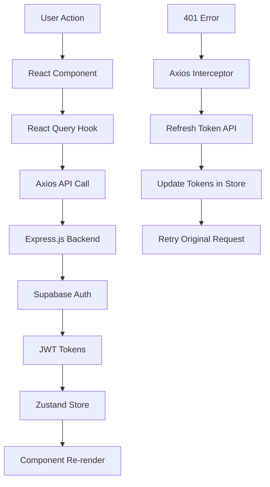

# Todo-List Frontend 🎨

React приложение с продвинутой системой авторизации и управлением задачами в темно-фиолетовой теме.

## 📋 Содержание

- [Технологии](#технологии)
- [Установка](#установка)
- [Архитектура](#архитектура)
- [Система авторизации](#система-авторизации)
- [Zustand State Management](#zustand-state-management)
- [React Query интеграция](#react-query-интеграция)
- [API Integration](#api-integration)
- [Компоненты UI](#компоненты-ui)
- [Дизайн система](#дизайн-система)

## 🛠 Технологии

- **Next.js 15** - React фреймворк с App Router
- **TypeScript** - типизированный JavaScript
- **SCSS** - препроцессор CSS
- **Zustand** - легковесный state management
- **React Query (TanStack Query)** - управление серверным состоянием
- **Axios** - HTTP клиент с interceptors

## 📦 Установка

1. **Переход в директорию**

   ```bash
   cd todo-list
   ```

2. **Установка зависимостей**

   ```bash
   npm install
   # или
   yarn install
   # или
   bun install
   ```

3. **Настройка переменных окружения**
   ```bash
   cp .env.example .env.local
   ```

### Переменные окружения (.env.local)

```env
# Backend API URL
NEXT_PUBLIC_API=http://localhost:5000
```

## 🏗 Архитектура

```
src/
├── app/                     # Next.js App Router
│   ├── (auth)/             # Группа маршрутов авторизации
│   │   ├── layout.tsx      # Layout для auth страниц
│   │   ├── sign-in/        # Страница входа
│   │   │   └── page.tsx
│   │   └── sign-up/        # Страница регистрации
│   │       └── page.tsx
│   ├── (site)/            # Основные страницы приложения
│   │   ├── layout.tsx     # Layout с Header
│   │   └── (home)/        # Главная страница
│   │       └── page.tsx
│   ├── globals.scss       # Глобальные стили
│   └── layout.tsx         # Корневой layout
├── components/            # React компоненты
│   ├── layout/           # Компоненты макета
│   │   ├── LayoutAuth.tsx    # Layout для авторизации
│   │   ├── LayoutSite.tsx    # Layout для основного сайта
│   │   └── header/           # Header компонент
│   │       ├── Header.tsx
│   │       └── Header.module.scss
│   └── pages/           # Страничные компоненты
│       ├── auth/       # Компоненты авторизации
│       │   ├── SignInPage.tsx
│       │   ├── SignInPage.module.scss
│       │   ├── SignUpPage.tsx
│       │   └── SignUpPage.module.scss
│       └── home/       # Компоненты главной страницы
│           ├── index.tsx
│           └── sections/
│               ├── TodoAdd.tsx     # Форма добавления задач
│               ├── TodoAdd.module.scss
│               ├── TodoList.tsx    # Список задач
│               └── TodoList.module.scss
├── api/                 # API интеграция
│   ├── index.ts        # Axios конфигурация + interceptors
│   ├── user/          # API для пользователей
│   │   ├── index.ts   # Хуки React Query
│   │   └── type.d.ts  # TypeScript типы
│   └── todo/          # API для задач
│       ├── index.ts   # Хуки React Query
│       └── type.d.ts  # TypeScript типы
├── stores/             # Zustand stores
│   └── useAuthStore.ts # Глобальное состояние авторизации
└── providers/          # React провайдеры
    ├── ReactQueryProvider.tsx  # Провайдер React Query
    └── SessionProvider.tsx     # Провайдер сессий
```

## 🔐 Система авторизации

### Архитектура авторизации



### Zustand Auth Store - Детальный разбор

```typescript
// stores/useAuthStore.ts
interface IAuthStore {
	// Состояние
	user: IUser | null; // Локальный профиль пользователя
	accessToken: string | null; // JWT токен для API запросов
	refreshToken: string | null; // Токен для обновления access token

	// Действия
	setAuth: (user: IUser, accessToken: string, refreshToken: string) => void;
	updateTokens: (accessToken: string, refreshToken: string) => void;
	getAccessToken: () => string | null; // Получить текущий access token
	getRefreshToken: () => string | null; // Получить refresh token
	clearAuth: () => void; // Очистить все данные авторизации
	isAuthenticated: () => boolean; // Проверка авторизации
}

// Пример использования persist middleware
export const useAuthStore = create<IAuthStore>()(
	persist(
		(set, get) => ({
			// Начальное состояние
			user: null,
			accessToken: null,
			refreshToken: null,

			// Установка полной авторизации (после входа/регистрации)
			setAuth: (user, accessToken, refreshToken) => {
				set({ user, accessToken, refreshToken });
			},

			// Обновление только токенов (после refresh)
			updateTokens: (accessToken, refreshToken) => {
				set({ accessToken, refreshToken });
			},

			// Геттеры для безопасного доступа к токенам
			getAccessToken: () => get().accessToken,
			getRefreshToken: () => get().refreshToken,

			// Полная очистка (при выходе или ошибке авторизации)
			clearAuth: () => {
				set({ user: null, accessToken: null, refreshToken: null });
			},

			// Проверка состояния авторизации
			isAuthenticated: () => {
				const { accessToken } = get();
				return !!accessToken;
			},
		}),
		{
			name: "auth_store", // Ключ для localStorage
			// Указываем какие поля сохранять в localStorage
			partialize: (state) => ({
				user: state.user,
				accessToken: state.accessToken,
				refreshToken: state.refreshToken,
			}),
		}
	)
);
```

### Автоматический Refresh Token Flow

```typescript
// api/index.ts - детальная реализация

let isRefreshing = false; // Флаг процесса обновления
let failedQueue: Array<{
	// Очередь неудачных запросов
	resolve: (value?: any) => void;
	reject: (reason?: any) => void;
}> = [];

// Функция обработки очереди после refresh
const processQueue = (error: any, token: string | null = null) => {
	failedQueue.forEach(({ resolve, reject }) => {
		if (error) {
			reject(error);
		} else {
			resolve(token);
		}
	});

	failedQueue = [];
};

// Request interceptor - добавляет токен к каждому запросу
api.interceptors.request.use((config) => {
	const token = useAuthStore.getState().getAccessToken();
	if (token) {
		config.headers.Authorization = `Bearer ${token}`;
	}
	return config;
});

// Response interceptor - обрабатывает 401 ошибки
api.interceptors.response.use(
	(response) => response,
	async (error) => {
		const originalRequest = error.config;

		// Проверяем 401 ошибку и что это не повторный запрос
		if (error.response?.status === 401 && !originalRequest._retry) {
			// Если уже идет процесс обновления токена
			if (isRefreshing) {
				// Добавляем запрос в очередь
				return new Promise((resolve, reject) => {
					failedQueue.push({ resolve, reject });
				})
					.then((token) => {
						originalRequest.headers.Authorization = `Bearer ${token}`;
						return api(originalRequest);
					})
					.catch((err) => {
						return Promise.reject(err);
					});
			}

			originalRequest._retry = true;
			isRefreshing = true;

			const { getRefreshToken, clearAuth } = useAuthStore.getState();
			const refreshToken = getRefreshToken();

			if (!refreshToken) {
				clearAuth();
				window.location.href = "/sign-in";
				return Promise.reject(error);
			}

			try {
				// Запрос на обновление токена
				const response = await api.post("/user/refresh-token", {
					refresh_token: refreshToken,
				});

				const { access_token, refresh_token: newRefreshToken } =
					response.data.data.session;

				// Обновляем токены в store
				useAuthStore.getState().updateTokens(access_token, newRefreshToken);

				// Обрабатываем очередь успешно
				processQueue(null, access_token);

				// Повторяем оригинальный запрос с новым токеном
				originalRequest.headers.Authorization = `Bearer ${access_token}`;
				return api(originalRequest);
			} catch (refreshError) {
				// При ошибке обновления - выходим из системы
				processQueue(refreshError, null);
				useAuthStore.getState().clearAuth();
				window.location.href = "/sign-in";
				return Promise.reject(refreshError);
			} finally {
				isRefreshing = false;
			}
		}

		return Promise.reject(error);
	}
);
```

## 📊 React Query интеграция

### Настройка провайдера

```typescript
// providers/ReactQueryProvider.tsx
"use client";
import { QueryClient, QueryClientProvider } from "@tanstack/react-query";
import { ReactQueryDevtools } from "@tanstack/react-query-devtools";
import { useState } from "react";

export default function ReactQueryProvider({
	children,
}: {
	children: React.ReactNode;
}) {
	const [queryClient] = useState(
		() =>
			new QueryClient({
				defaultOptions: {
					queries: {
						staleTime: 60 * 1000, // Данные свежие 1 минуту
						gcTime: 10 * 60 * 1000, // Кэш хранится 10 минут
						retry: (failureCount, error: any) => {
							// Не повторять при 401/403 ошибках
							if (
								error?.response?.status === 401 ||
								error?.response?.status === 403
							) {
								return false;
							}
							return failureCount < 3;
						},
					},
					mutations: {
						retry: false, // Не повторять мутации автоматически
					},
				},
			})
	);

	return (
		<QueryClientProvider client={queryClient}>
			{children}
			<ReactQueryDevtools initialIsOpen={false} />
		</QueryClientProvider>
	);
}
```

### User API Хуки - подробный разбор

```typescript
// api/user/index.ts

// Хук для получения профиля пользователя
const useGetMeQuery = (query: USER.GetMeReq) => {
	const { isAuthenticated } = useAuthStore();

	return useQuery<USER.GetMeRes>({
		queryKey: ["me"], // Уникальный ключ для кэширования
		queryFn: async () => {
			const response = await api.get(`/user/me`);
			return response.data;
		},
		enabled: query.enabled && isAuthenticated(), // Выполнять только если авторизован
		staleTime: 5 * 60 * 1000, // Данные профиля свежие 5 минут
		gcTime: 10 * 60 * 1000, // Кэш профиля 10 минут
		retryDelay: 100, // Задержка между повторами
	});
};

// Хук для входа в систему
const useSignInMutation = () => {
	const queryClient = useQueryClient();
	const { setAuth } = useAuthStore();

	return useMutation<USER.SignInRes, Error, USER.SignInReq>({
		mutationFn: async (data) => {
			const response = await api.post("/user/sign-in", data);
			return response.data;
		},
		onSuccess: (data) => {
			// При успешном входе сохраняем данные в store
			if (data.success && data.data.session && data.data.localUser) {
				setAuth(
					data.data.localUser,
					data.data.session.access_token,
					data.data.session.refresh_token
				);
			}

			// Инвалидируем кэш профиля для обновления
			queryClient.invalidateQueries({
				queryKey: ["me"],
			});
		},
		onError: (error) => {
			console.error("Ошибка входа:", error);
			// Можно добавить toast уведомление
		},
	});
};

// Хук для регистрации
const useSignUpMutation = () => {
	const queryClient = useQueryClient();
	const { setAuth } = useAuthStore();

	return useMutation<USER.SignUpRes, Error, USER.SignUpReq>({
		mutationFn: async (data) => {
			const response = await api.post("/user/sign-up", data);
			return response.data;
		},
		onSuccess: (data) => {
			// Аналогично входу - сохраняем данные
			if (data.success && data.data.session && data.data.localUser) {
				setAuth(
					data.data.localUser,
					data.data.session.access_token,
					data.data.session.refresh_token
				);
			}

			// Предварительно заполняем кэш профиля
			queryClient.setQueryData(["me"], {
				success: true,
				data: data.data.localUser,
			});
		},
	});
};

// Хук для выхода из системы
const useSignOutMutation = () => {
	const queryClient = useQueryClient();
	const { clearAuth } = useAuthStore();

	return useMutation<USER.SignOutRes, Error, void>({
		mutationFn: async () => {
			const response = await api.post("/user/sign-out");
			return response.data;
		},
		onSuccess: () => {
			// Очищаем состояние авторизации
			clearAuth();
			// Очищаем весь кэш React Query
			queryClient.clear();
		},
		onError: () => {
			// Даже при ошибке API - очищаем локальное состояние
			clearAuth();
			queryClient.clear();
		},
	});
};
```

### Todo API Хуки

```typescript
// api/todo/index.ts

// Получение списка задач пользователя
const useGetTodosQuery = (params: TODO.GetTodosReq) => {
	const { isAuthenticated } = useAuthStore();

	return useQuery<TODO.GetTodosRes>({
		queryKey: ["todos"],
		queryFn: async () => {
			const response = await api.get(`/todo-prisma/get-all`);
			return response.data;
		},
		enabled: params.enabled && isAuthenticated(),
		staleTime: 2 * 60 * 1000, // Задачи свежие 2 минуты
		refetchOnWindowFocus: true, // Обновляять при фокусе окна
	});
};

// Создание новой задачи
const useCreateTodoMutation = () => {
	const queryClient = useQueryClient();

	return useMutation<TODO.CreateTodoRes, Error, TODO.CreateTodoReq>({
		mutationFn: async (data) => {
			const { userId, ...todoData } = data;
			const response = await api.post(`/todo-prisma/create`, todoData);
			return response.data;
		},
		onSuccess: (newTodo) => {
			// Optimistic Update - обновляем кэш мгновенно
			queryClient.setQueryData(
				["todos"],
				(oldData: TODO.GetTodosRes | undefined) => {
					if (!oldData) return oldData;

					return {
						...oldData,
						data: [...oldData.data, newTodo.data],
					};
				}
			);

			// Альтернативно - просто инвалидировать кэш
			// queryClient.invalidateQueries({ queryKey: ["todos"] });
		},
		onError: () => {
			// При ошибке - инвалидируем кэш для перезагрузки актуальных данных
			queryClient.invalidateQueries({ queryKey: ["todos"] });
		},
	});
};
```

## 🎨 Компоненты UI

### Форма входа с React Query

```typescript
// components/pages/auth/SignInPage.tsx
export const SignInPage: FC = () => {
	const router = useRouter();
	const { setAuth } = useAuthStore();
	const signInMutation = useSignInMutation();

	const [formData, setFormData] = useState({
		email: "",
		password: "",
	});

	const handleSubmit = async (e: React.FormEvent) => {
		e.preventDefault();

		try {
			const res = await signInMutation.mutateAsync(formData);
			if (res.success && res.data.session && res.data.localUser) {
				setAuth(
					res.data.localUser,
					res.data.session.access_token,
					res.data.session.refresh_token
				);
				router.push("/");
			}
		} catch (err: any) {
			console.error(err?.message || "Ошибка входа");
		}
	};

	// Обработка состояний загрузки и ошибок
	return (
		<form onSubmit={handleSubmit}>
			{/* Поля формы */}

			<button
				type="submit"
				disabled={signInMutation.isPending} // Блокируем при загрузке
			>
				{signInMutation.isPending ? "Входим..." : "Войти"}
			</button>

			{/* Отображение ошибок */}
			{signInMutation.error && (
				<div className={scss.error}>Ошибка: {signInMutation.error.message}</div>
			)}
		</form>
	);
};
```

### Header с проверкой авторизации

```typescript
// components/layout/header/Header.tsx
export const Header: FC = () => {
	const router = useRouter();
	const { user, isAuthenticated, clearAuth } = useAuthStore();
	const signOutMutation = useSignOutMutation();

	// Загружаем данные профиля если авторизован
	const { data: meData } = useGetMeQuery({
		enabled: isAuthenticated(),
	});

	const handleLogOut = async () => {
		try {
			await signOutMutation.mutateAsync();
		} catch (error) {
			// Даже при ошибке API - очищаем локальное состояние
			clearAuth();
		}
		router.push("/sign-in");
	};

	return (
		<header>
			{isAuthenticated() && (meData?.success || user) ? (
				<div className={scss.userInfo}>
					<span>{meData?.data?.fullName || user?.fullName}</span>
					<span>{meData?.data?.email || user?.email}</span>
					<button onClick={handleLogOut} disabled={signOutMutation.isPending}>
						{signOutMutation.isPending ? "Выход..." : "Выйти"}
					</button>
				</div>
			) : (
				<div className={scss.authButtons}>
					<button onClick={() => router.push("/sign-up")}>Регистрация</button>
					<button onClick={() => router.push("/sign-in")}>Вход</button>
				</div>
			)}
		</header>
	);
};
```

## 🎨 Дизайн система

### Цветовая палитра

```scss
// Основные цвета темно-фиолетовой темы
:root {
	// Primary colors
	--primary: #8b5cf6;
	--primary-dark: #7c3aed;
	--primary-light: #a855f7;
	--primary-lighter: #c084fc;

	// Background colors
	--bg-gradient: linear-gradient(
		135deg,
		#1a0e3d 0%,
		#2d1b69 25%,
		#4a2c96 50%,
		#6b3cc3 75%,
		#8b5cf6 100%
	);
	--bg-dark: rgba(15, 23, 42, 0.95);
	--bg-card: rgba(30, 41, 59, 0.6);

	// Text colors
	--text-primary: #f8fafc;
	--text-secondary: #e2e8f0;
	--text-muted: #94a3b8;

	// Effects
	--border-glow: rgba(139, 92, 246, 0.3);
	--shadow-glow: 0 10px 25px -5px rgba(139, 92, 246, 0.4);
	--backdrop-blur: blur(20px);
}
```

### Компоненты стилей

```scss
// Базовые стили для форм авторизации
.authPage {
	min-height: 100vh;
	display: flex;
	align-items: center;
	justify-content: center;
	background: var(--bg-gradient);
	position: relative;

	&::before {
		content: "";
		position: absolute;
		top: 0;
		left: 0;
		right: 0;
		bottom: 0;
		background: radial-gradient(
			circle at 30% 40%,
			rgba(139, 92, 246, 0.3) 0%,
			transparent 50%
		);
		pointer-events: none;
	}

	.content {
		background: var(--bg-dark);
		backdrop-filter: var(--backdrop-blur);
		border: 1px solid var(--border-glow);
		border-radius: 20px;
		padding: 3rem;
		box-shadow: var(--shadow-glow);
		position: relative;
		z-index: 1;
	}
}

// Стили для инпутов
.input {
	width: 100%;
	padding: 1rem;
	background: var(--bg-card);
	border: 1px solid var(--border-glow);
	border-radius: 12px;
	color: var(--text-primary);
	transition: all 0.3s ease;

	&:focus {
		outline: none;
		border-color: var(--primary);
		background: rgba(30, 41, 59, 0.8);
		box-shadow: 0 0 0 3px rgba(139, 92, 246, 0.1);
		transform: translateY(-1px);
	}
}

// Стили для кнопок
.button {
	padding: 1rem;
	background: linear-gradient(
		135deg,
		var(--primary) 0%,
		var(--primary-dark) 100%
	);
	color: white;
	border: none;
	border-radius: 12px;
	cursor: pointer;
	transition: all 0.3s ease;
	position: relative;
	overflow: hidden;

	&:hover:not(:disabled) {
		background: linear-gradient(135deg, var(--primary-dark) 0%, #6d28d9 100%);
		transform: translateY(-2px);
		box-shadow: var(--shadow-glow);
	}

	&:disabled {
		background: rgba(71, 85, 105, 0.5);
		cursor: not-allowed;
		transform: none;
	}
}
```

## 🚀 Запуск приложения

### Разработка

```bash
npm run dev
# или
yarn dev
# или
bun dev
```

Приложение будет доступно: `http://localhost:3000`

### Продакшн

```bash
npm run build
npm start
```

## 🔧 Расширение функционала

### Добавление нового API хука

```typescript
// 1. Определить типы в api/user/type.d.ts
namespace USER {
	type UpdateProfileReq = {
		fullName?: string;
		age?: number;
	};

	type UpdateProfileRes = {
		success: boolean;
		data: IUser;
	};
}

// 2. Создать хук в api/user/index.ts
const useUpdateProfileMutation = () => {
	const queryClient = useQueryClient();

	return useMutation<USER.UpdateProfileRes, Error, USER.UpdateProfileReq>({
		mutationFn: async (data) => {
			const response = await api.patch("/user/update", data);
			return response.data;
		},
		onSuccess: (updatedUser) => {
			// Обновляем кэш профиля
			queryClient.setQueryData(["me"], {
				success: true,
				data: updatedUser.data,
			});

			// Обновляем локальное состояние
			useAuthStore
				.getState()
				.setAuth(
					updatedUser.data,
					useAuthStore.getState().accessToken!,
					useAuthStore.getState().refreshToken!
				);
		},
	});
};

// 3. Экспортировать хук
export { useUpdateProfileMutation };
```

## 🛡 Лучшие практики

### React Query

- ✅ Используйте уникальные queryKey для каждого типа данных
- ✅ Настраивайте staleTime в зависимости от частоты изменения данных
- ✅ Используйте optimistic updates для лучшего UX
- ✅ Обрабатывайте состояния loading, error, success

### Zustand

- ✅ Группируйте связанные состояния в одном store
- ✅ Используйте persist для важных данных
- ✅ Создавайте селекторы для оптимизации re-renders
- ✅ Избегайте мутаций состояния напрямую

### Безопасность

- ✅ Никогда не храните sensitive данные в localStorage
- ✅ Проверяйте авторизацию на каждом защищенном маршруте
- ✅ Используйте HTTPS в продакшене
- ✅ Валидируйте данные на клиенте и сервере

---

**Автор**: ElchoDev  
**Дизайн**: Dark Purple Glassmorphism  
**Технологии**: Next.js 15 + TypeScript + Zustand + React Query
